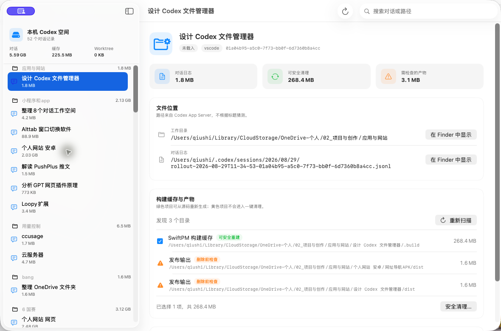
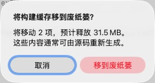
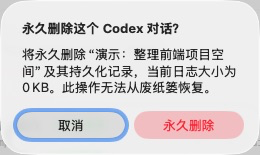

# Codex File Manager

[中文](README.md) · [Public beta](https://github.com/Qiushi0919/Codex-File-Manager/releases/tag/v0.1.0-beta.1) · [Privacy](PRIVACY.md)

An open-source native macOS utility for locating Codex conversation logs and project workspaces, inspecting common build artifacts, and reclaiming space with conservative cleanup rules.

> **Unofficial community project:** This project is not affiliated with or endorsed by OpenAI. Codex and OpenAI are trademarks of their respective owners.

## Features

- Reads thread titles, IDs, working directories, log paths, archive state, and timestamps through the user's local `codex app-server`.
- Groups threads by workspace and reports the disk usage of logs and Codex storage locations.
- Finds rebuildable caches such as `node_modules`, `.gradle`, `.build`, `.next`, and `__pycache__`.
- Moves only high-confidence cache candidates to the macOS Trash. Potential deliverables such as `dist`, `build`, and APK files are review-only.
- Archives or permanently deletes threads through App Server instead of editing Codex's private database.
- Includes a read-only JSON CLI, `codexfm`, for scripts and future Skill integrations.

## Screenshots

The main window is a real runtime screenshot. The two destructive-action confirmations use demo data, and no deletion was performed while capturing them.

### Threads, file locations, and disk usage



| Recoverable cache cleanup | Permanent thread deletion protection |
| --- | --- |
|  |  |

## Requirements

- macOS 14 Sonoma or later, on Apple Silicon or Intel
- ChatGPT/Codex installed and signed in, or a working `codex` CLI on PATH

The app does not bundle Codex, account tokens, or user data. Set `CODEX_BINARY` if Codex is installed in a custom location.

## Install the public beta

1. Download the macOS Universal ZIP from [GitHub Releases](https://github.com/Qiushi0919/Codex-File-Manager/releases).
2. Unzip it and move Codex File Manager to Applications.
3. This beta is not yet Apple-notarized. On first launch, Control-click the app and choose **Open**. If macOS still blocks it, use **System Settings → Privacy & Security → Open Anyway**.

Only download builds from this repository's Releases page. The current beta is ad-hoc signed; Developer ID signing and Apple notarization will be added when the required certificate is available.

## Build from source

```bash
swift test
./scripts/build-app.sh
open "dist/Codex File Manager.app"
```

The build script creates a Universal macOS app, a release ZIP, and the read-only `dist/bin/codexfm` CLI. See the Chinese README for signing and notarization environment variables.

## Safety model

- Known rebuildable caches are eligible for cleanup and are moved to Trash.
- Potential deliverables are displayed but never selected automatically.
- Permanent thread deletion uses App Server, requires an in-app confirmation, and cannot be recovered from Trash.
- Active or recently updated threads are protected.
- `.env` files, certificates, keystores, private keys, and unknown directories are never cleanup targets.

Back up or commit important work before deleting anything. See [PRIVACY.md](PRIVACY.md) for data handling details.

## App Server

The [official OpenAI documentation](https://learn.chatgpt.com/docs/app-server) describes Codex App Server as the protocol for rich Codex clients and notes that its implementation is open source. This app launches it locally over `stdio`; it does not expose a network listener.

## Limitations

- Codex does not provide a complete manifest of files produced by each conversation. Historical artifact attribution is therefore conservative and based on workspace, Git state, and timestamps.
- Project grouping follows App Server's `projectId` and working directory, not private sidebar-ordering data.
- App Server compatibility can change with Codex versions. When reporting a compatibility issue, include the Codex version but never include conversation content or tokens.

Contributions are welcome. Read [CONTRIBUTING.md](CONTRIBUTING.md) and [SECURITY.md](SECURITY.md) first.

Licensed under the [MIT License](LICENSE).
