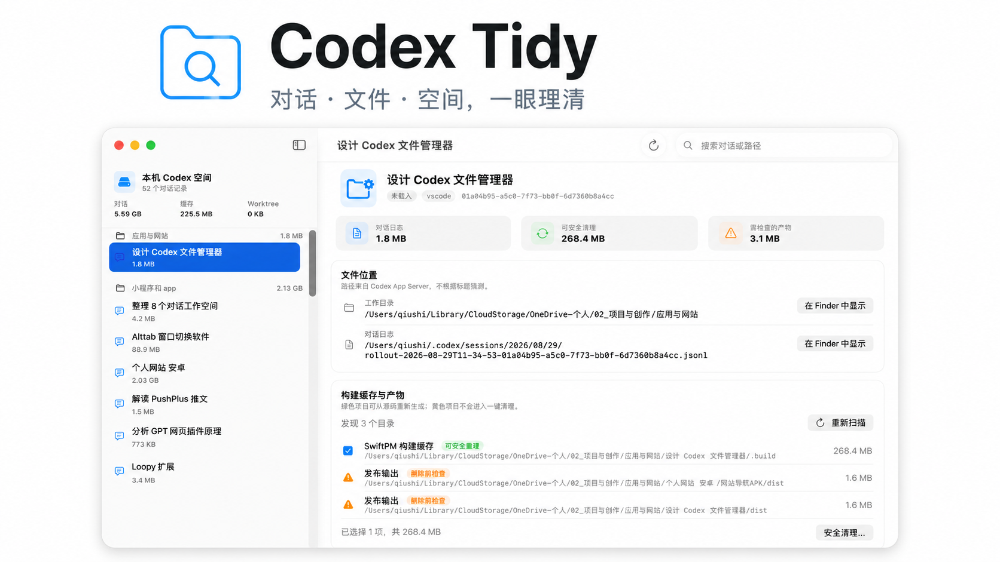

# Codex Tidy

[English](README.en.md) · [下载公开测试版](https://github.com/Qiushi0919/Codex-Tidy/releases/tag/v0.1.0-beta.2) · [隐私说明](PRIVACY.md)

> [!IMPORTANT]
> **⬇️ [下载最新 macOS Universal ZIP](https://github.com/Qiushi0919/Codex-Tidy/releases/download/v0.1.0-beta.2/Codex-Tidy-macOS-universal-v0.1.0-beta.2.zip)** · [查看所有版本](https://github.com/Qiushi0919/Codex-Tidy/releases)
>
> 安装包作为 GitHub Release 附件发布，因此不会出现在仓库源码文件列表中。



Codex Tidy 是一个开源的 macOS 原生工具，用来查看 Codex 对话文件、项目工作目录与常见构建缓存，并以保守规则释放磁盘空间。

> **非官方社区项目：** 本项目与 OpenAI 无隶属或背书关系。Codex 和 OpenAI 是其各自权利人的商标。

## 能做什么

- 通过用户本机的 `codex app-server` 读取对话标题、ID、工作目录、日志路径、归档状态和更新时间。
- 刷新时完整遍历 App Server 分页，按 Codex 当前项目根目录组织对话。
- 对项目内存在 `对话目录映射.json` 的工作区，可把搬家前的历史路径重新定位到当前文件夹。
- 侧栏同时显示项目文件夹、每个对话工作目录与对话日志的实际占用。
- 扫描 `node_modules`、`.gradle`、`.build`、`.next`、`__pycache__` 等可重建缓存。
- 只把高置信度缓存移到 macOS 废纸篓；`dist`、`build`、APK 等潜在成果只供检查。
- 通过 App Server 归档或永久删除对话，不直接修改 Codex 的 SQLite 数据库。
- 启动后每天检查一次 GitHub Releases；也可从侧栏顶部手动检查，发现新版后由用户决定是否打开下载页。
- 附带只读 `codexfm` CLI，方便脚本或后续 Skill 调用。

## 运行截图

主界面为真实运行截图；两个危险操作确认窗口使用演示数据，截图过程中没有执行删除。

### 对话、文件位置与空间总览


| 可恢复的缓存清理 | 对话永久删除保护 |
| --- | --- |
|  |  |

## 系统要求

- macOS 14 Sonoma 或更高版本（Apple Silicon 与 Intel 均支持）
- 已安装并登录 ChatGPT/Codex，或 PATH 中存在可用的 `codex` CLI

应用不会捆绑 Codex、账号令牌或用户数据。它优先寻找 ChatGPT 应用内的 Codex，也支持用 `CODEX_BINARY` 指定可执行文件。

## 安装公开测试版

1. 从 [GitHub Releases](https://github.com/Qiushi0919/Codex-Tidy/releases) 下载 macOS Universal ZIP。
2. 解压并把“Codex Tidy”拖入“应用程序”。
3. 当前 Beta 尚未经过 Apple 公证。第一次打开时，请右键应用选择“打开”；若仍被拦截，可到“系统设置 → 隐私与安全性”选择“仍要打开”。

请仅从本仓库的 Releases 下载。本测试包使用 ad-hoc 签名，正式 Developer ID 签名和 Apple 公证会在取得相应证书后补上。

## 从源码构建

需要 Xcode Command Line Tools：

```bash
swift test
./scripts/build-app.sh
open "dist/Codex Tidy.app"
```

生成内容：

- `dist/Codex Tidy.app`：通用架构 macOS 应用。
- `dist/Codex-Tidy-macOS-universal-v0.1.0-beta.2.zip`：发布包。
- `dist/bin/codexfm`：通用架构只读命令行工具。

有 Developer ID 证书时可这样签名；若同时配置 `notarytool` 钥匙串配置，还会自动提交公证：

```bash
DEVELOPER_ID_APPLICATION="Developer ID Application: Your Name (TEAMID)" \
NOTARYTOOL_PROFILE="codex-tidy" \
./scripts/build-app.sh
```

## CLI

```bash
codexfm list
codexfm storage
codexfm scan "/path/to/project"
```

所有 CLI 输出均为 JSON。CLI 不提供删除命令，避免脚本误删。

## 数据安全边界

- 绿色项目：只包含已知可重建缓存，清理时进入废纸篓。
- 黄色项目：可能是最终构建产物，只显示、不自动选择。
- 对话永久删除：使用 App Server 的 `thread/delete`，不可从废纸篓恢复，并在窗口内二次确认。
- 最近一小时更新或正在运行的对话：禁止归档和永久删除。
- `.env`、证书、keystore、私钥及未知目录永不进入自动清理规则。
- App Server 独立进程无法完整感知另一个 Codex 窗口的实时状态，因此“最近一小时保护”是额外的保守措施。

删除前仍请确认重要成果已经提交到 Git、备份或另行保存。更完整的数据处理说明见 [PRIVACY.md](PRIVACY.md)。

## App Server 与社区分享

[OpenAI 官方文档](https://learn.chatgpt.com/docs/app-server)将 Codex App Server 定位为构建富客户端的集成接口，并说明其实现开源。本项目只通过本机 `stdio` 启动 App Server，不监听网络端口；实验性的远程 WebSocket 不在支持范围内。

## 已知限制

- Codex 没有提供“某次对话生成的全部成果文件”清单；历史成果归属只能通过目录、Git 和时间做保守推断。
- 项目分组以 App Server 返回的当前项目根目录为准，可选读取项目自己的 `对话目录映射.json`；不读取 Codex 私有数据库。
- 目录扫描默认限制深度和访问数量，以免在大型磁盘上长时间阻塞。
- `codex app-server` 协议仍可能随 Codex 版本变化；遇到兼容问题请提交 Issue，并附 Codex 版本但不要附对话内容或令牌。

## 参与贡献

Bug、兼容性报告和安全规则改进都欢迎。开始前请阅读 [CONTRIBUTING.md](CONTRIBUTING.md) 和 [SECURITY.md](SECURITY.md)。

本项目采用 [MIT License](LICENSE)。
